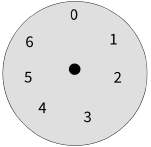

# Modular Arithmetic

**Modular Arithmetic also known as Clock Arithmetic.**

## 1.For set of Integers S={0,1,2,3,4,5,6}
What is
a) 4 + 4
b) 3 x 5
c) what is the inverse of 3 ?

**1. What is 4+4 ?**    
Refrencing to clock image pointing the arrow to four and then move 4 steps forward, its 1. 
Integer mod 7 
**8 mod 7 =1**

**2. What is 3x5 ?**    
Refrencing to clock image again pointing the arrow to 3 move it 3 steps forward 4 times we get 1. 
Integer mod 7 
**15 mod 7=1**

**3. what is the inverse of 3 ?**   
Opposite element is called Inverse.
So Inverse of 3 is -3 which is basically 4, but how? See below 
-3 mod 7, 
To get the remainder we have to find the number which is closest to -3 and also divisible by 7 which is basically -7.
-7 is closest and less than -3 and also divisible by 7.

**-3 mod 7 = 4**

## 2.For S = {0,1,2,3,4,5,6} Can we consider 'S' and the operation '+' to be a group ?

Yes

## 3.What is -13 mod 5 ?  
-15 is closest and less than -13 and also divisible by 5.
So, -13 mod 5 =2
